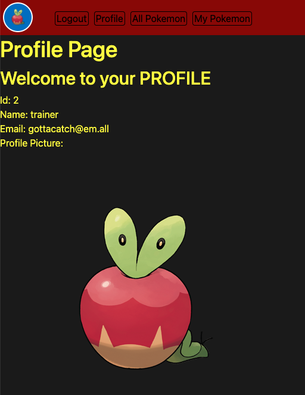
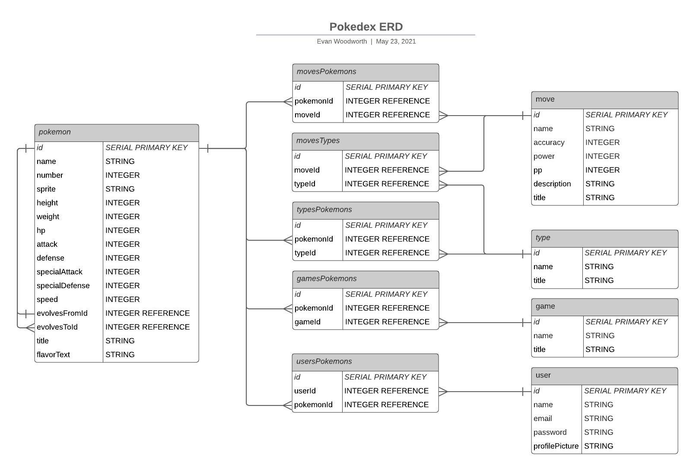

# Poke-Track

A personalized database of all known pokemon. Keep track of the pokemon that you've caught, and view basic information about all pokemon!

[Poke-track via Heroku](https://poke-track.herokuapp.com/)

[Poke-Track Github Repository](https://github.com/evan-woodworth/Pokedex)


---

## User Stories

As a user, I want to:

- Be able to view a list of all pokemon:
  - In a given game
  - Of a given type
  - In my collection
  - As a whole
- Be able to view details about the base version of a pokemon:
  - Various stats
  - An image of what they look like
  - Starting moves
  - Evolution chain
  - Elemental properties (types)
- Feel like I'm using a pokedex:
  - Relevant graphics
  - Menu system layout
  - Adapted to a webpage layout

---

## Key Features

- View all pokemon: 

  - 

- Sort those pokemon by game or type:

  - 

- View details for a particular pokemon:

  - 

- Add pokemon to your collection:

  - 

- Update your profile picture with your favorite pokemon!

  - 

---

## How It Works

Simply put, Poke-Track stores pokemon data from an API, creates relevant associations, and creaters associations between users and their pokemon.

---

### Entity Relationship Diagram

The following ERD details the specific information stored by Poke-Track's database, and the associations within.



The database was created using the [Sequelize ORM](https://sequelize.org/). Join tables were used to allow associations between foreign models, like so:

```js
models.pokemon.belongsToMany(models.game,{through:'gamesPokemons'});
```

Associations were also made within the same "pokemon" model, allowing for evolution chains to be tracked appropriately:

```js
models.pokemon.hasOne(models.pokemon,{
  as:'evolvesFrom',
  foreignKey:'evolvesToId',
  targetKey:'id'
});
```

---


### Seeding

The seed files pull information from [the pokemon API](https://pokeapi.co/) and populate the database with everything but the images, which are accessed via the internet as needed.

The simpler models are seeded first:

```js
const fetchTypeData = async () => {
  const response = await axios.get("http://pokeapi.co/api/v2/type/");
  const { results } = response.data;
  let theCount = 0;
  for await (const type of results) {
    const typeResponse = await axios.get(type.url);
    const typeDetails = typeResponse.data;
    let title = '';
    typeDetails.names.forEach(entry=>{if(entry.language.name == "en"){title = entry.name;}})
    db.type.create({
      name:type.name,
      title
    })
    theCount++;
    console.clear()
    console.log(`${theCount} of 20`)
  }
}
```

Followed by the more complicated seeding, involving deeper delving into the API, as well as defining associations.

```js
const fetchPokemonData = async () => {
  //the first query
  const response = await axios.get("http://pokeapi.co/api/v2/pokemon-species/?limit=898"); 
  const { results } = response.data;
  let theCount = 0;
  for await (const species of results) {
    //the second query
    const speciesResponse = await axios.get(species.url); 
    const speciesDetails = speciesResponse.data;
    //the third query
    const pokemonResults = await axios.get(speciesDetails.varieties[0].pokemon.url); 
    const pokemonDetails = pokemonResults.data;
    // various definitions and assignments
    // ...
    // ...
    // find the pokemon's types
    pokemonDetails.types.forEach(typeCase=>{typeList.push(typeCase.type.name)});
    // find the pokemon's moves
    pokemonDetails.moves.forEach(moveCase=>{
      moveCase.version_group_details.forEach(vgCase=>{
        // ...
      })
    });
    // find the pokemon's games
    pokemonDetails.game_indices.forEach(gameIndex=>{gameList.push(gameIndex.version.name);})
    // create the pokemon
    const newPokemon = await db.pokemon.create({
    // ...
    });
    // add the pokemon's types, moves, and games (associations)
    const theTypes = await db.type.findAll({where:{name:typeList}});
    const theMoves = await db.move.findAll({where:{name:moveList}});
    const theGames = await db.game.findAll({where:{name:gameList}});
    theTypes.forEach(type=>{newPokemon.addType(type)});
    theMoves.forEach(move=>{newPokemon.addMove(move)});
    theGames.forEach(game=>{newPokemon.addGame(game)});
    // keep track of how far along you are
    theCount++;
    console.clear()
    console.log(`${theCount} of 898`)
  }
}
```

---

### RESTful Routing

The following table illustrates the routes that are used by the server to allow a user to navigate between views and interact with the database.

 Verb | URL | Action | Description
 ----------- | ----------- | ----------- | -----------
 GET | / | Index (Read) | Main display
 GET | /auth/login | login (Read) | Log in screen
 GET | /auth/signup | signup (Read) | Sign up screen for new account
 GET | /auth/logout | logout (Read) | Log out of current account
 POST | /auth/login | login (Create) | Log in to an existing account
 POST | /auth/signup | signup (Create) | Sign up and log in
 GET | /pokemon | display (Read) | display pokemon information
 GET | /pokemon/collection | display (Read) | display collected pokemon
 GET | /filter/:toggle/:value | display (read) | display filtered pokemon
 GET | /pokemon/:id | display (Read) | display specific pokemon information
 POST | /pokemon/ | Create (Create) | add pokemon to collection by id
 DELETE | /pokemon/ | Delete (Remove) | remove a pokemon from user's collection
 PUT | /pokemon/ | Update (update) | change a user's profile picture to that of the currently viewed pokemon

Here's an example of a route handled by the server, through the pokemon controller:

```js
router.get('/:id', isLoggedIn, async (req,res)=>{

  // the pokemon specified by the "id" parameter is found within the database,
  // along with all of the associated information from the other models
  const thePokemon = await db.pokemon.findOne({
      where:{number:req.params.id},
      include:[db.type,db.move,db.game,db.user]
  });

  // the current user is found within the database,
  // along with all pokemon associated with the user
  const theUser = await db.user.findOne({where:{name:req.user.name},include:[db.pokemon]});

  // a list is made with each associated pokemon's name
  const pokemonList = [];
  theUser.pokemons.forEach(pokemon=>pokemonList.push(pokemon.name));

  // collectionStatus keeps track of whether or not the found pokemon
  // has been collected by the user, then it is passed along the route
  collectionStatus = pokemonList.includes(thePokemon.name);

  // The associated evolutions, games, and types are stored and passed along the route
  const lastForm = await thePokemon.getEvolvesFrom();
  const nextForms = await thePokemon.getEvolvesTo();
  const theGames = await db.game.findAll();
  const theTypes = await db.type.findAll();

  // sorting
  theGames.sort((a, b) => (a.name > b.name) ? 1 : -1);
  theTypes.sort((a, b) => (a.name > b.name) ? 1 : -1);

  // the collected information is passed along to a view,
  // which has been tailored to show information about one pokemon
  res.render('pokemon/show',{thePokemon, theGames, theTypes, lastForm, nextForms, collectionStatus})
})
```

---

### The Views

Poke-Track uses [Express](https://expressjs.com/) framework for [Node.js](https://nodejs.org/en/), along with [Express EJS](https://ejs.co/) to render HTML "views" with javascript. Structurally, each view represents a different "page". Poke-Track's basic structure is as follows:

```
Main -- Index - The Home page, provides a landing zone for users before they log in
|    |- Profile - Provide's profile information for the user
|
+ auth -- signup - Allows user to create an account
|      |- login - Allows a user to log in with their account
|
+ pokemon -- index - Provides a space for listing icons for all requested pokemon
          |- show - Provides a space for showing details about a specific pokemon
```
The following code snippet is an example from the pokemon/show view. This block of code handles the game filters section of the view. Each game in the database is passed along the route, as well as a list of games associated with the pokemon being shown. The associated games are given the "active" class, providing for different styling rules.
```js
//...
<div id="toggle_games">
  <p class="grid_title">Game Filters</p>
  <div class="game_grid">
    <% theGames.forEach(game=>{ %>
      <% let active = (theValidGames.includes(game.name) ? 'active' : 'inactive') %> 
      <div class="game <%=active%>" onclick="location.href='/pokemon/filter/theValidGames/<%= game.name %>';">
        <p><%= game.title ? game.title : game.name %></p>
      </div>
    <% }) %>
    <div class="game active" onclick="location.href='/pokemon/collection';"><p>My Collection</p></div>
  </div>
</div>
//...
```
This next example shows how the pokemon/index view handles the pokemon icons. A list of pokemon is passed in from the route, then a "pokeCard" is created for each pokemon in the list. Each pokeCard shows an image of the pokemon, it's name, it's number, and displays a pokeball icon if it has been collected by the user. When a user clicks anywhere on the pokeCard, it sends the user to the "show" view for that pokemon.
```js
<div id="display_pokemon">
  <% allPokemon.forEach(pokemon => { %>
    <% let collected = (pokemonList.includes(pokemon.name) ? "collected" : "not_collected")  %> 
    <div class="pokeCard <%= collected %>" onclick="location.href='/pokemon/<%= pokemon.number %>';">
      <span style="position: relative;">
        " alt="<%= pokemon.title %>">
        <% if (pokemonList.includes(pokemon.name)) { %> 
          
        <% } %>
      </span>
      <p><%= pokemon.title %></p>
      <p><%= pokemon.number %></p>
    </div>
  <% }); %> 
</div>
```

---

## Installation Instructions

If you want your own copy of Poke-Track:
- Fork and clone [this repo](https://github.com/evan-woodworth/Pokedex)
- Install the necessary packages:
  - `npm install`
- Migrate:
  - `sequelize db:migrate`
- Seed with the following command in your cloned directory. **Make sure that each seed operation has completed before moving on to the next**:
  - `sequelize db:seed --seed 20210518230614-type.js`
  - `sequelize db:seed --seed 20210518232504-game.js`
  - `sequelize db:seed --seed 20210518232704-move.js`
  - `sequelize db:seed --seed 20210519002511-pokemon.js`
  - `sequelize db:seed --seed 20210519234347-evolutions.js`
- Visit your [local host port 3000](http://localhost:3000/) to begin!