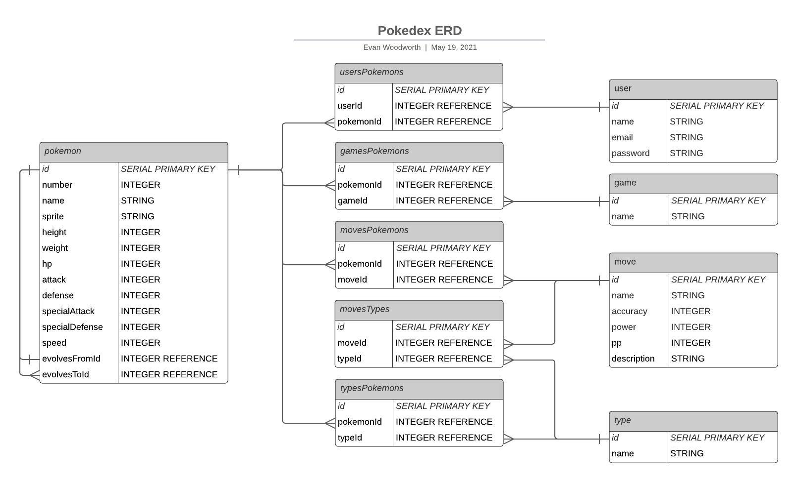

# Proposal
Requirements for the weekend

## `1` An application name / concept 

Pokedex

A personalized database of all known pokemon.

## `2` A repo for your project 2 (built from express_auth template)

[Pokedex](https://github.com/evan-woodworth/Pokedex)

## `3` Wireframe for your app - (Lucidchart)

## `4` An ERD with two models (minimum) > User + 1 Resource (one to many) - (Lucidchart)

## `5` Create (3-5) User Stories for the base user experience - ( [Reference](https://revelry.co/resources/development/user-stories-that-dont-suck/) )

As a user, I want to:

- Be able to view a list of all pokemon:
  - In a given region
  - In a given game
  - As a whole
- Be able to keep track of the pokemon that I have caught:
  - In a given region
  - In a given game
  - As a whole
- Be able to keep track of badges that I have earned:
  - In a given game
  - As a whole
- Be able to view details about the base version of a pokemon:
  - Various stats
  - An image of what they look like
  - Starting moves
  - Evolution chain
  - Elemental properties, strengths and weaknesses
- Be able to view information:
  - Moves that pokemon can make
  - Berries
- Feel like I'm using a pokedex:
  - Relevant graphics
  - Menu system layout
  - Adapted to a webpage layout

## `6` Resource's Restful Routing table ( [Readme](https://romebell.gitbook.io/sei-412/node-express/00readme-1/01intro-to-express/00readme#restful-routing) )

 Verb | URL | Action | Description
 ----------- | ----------- | ----------- | -----------
 GET | / | Index (Read) | Main display
 GET | /auth/login | login (Read) | Log in screen
 GET | /auth/signup | signup (Read) | Sign up screen for new account
 GET | /auth/logout | logout (Read) | Log out of current account
 POST | /auth/login | login (Create) | Log in to an existing account
 POST | /auth/signup | signup (Create) | Sign up and log in
 GET | /pokemon | display (Read) | display pokemon information
 GET | /pokemon/collection | display (Read) | display collected pokemon
 POST | /pokemon/collection/:id | Create (Create) | add pokemon to collection by id
 GET | /pokemon/:id | display (Read) | display specific pokemon information
 GET | /region | display (Read) | display region information
 GET | /region/:name | display (Read) | display specific region information
 GET | /move | display (Read) | display move information
 GET | /move/:name | display (Read) | display specific move information
 GET | /game | display (Read) | display game information
 GET | /game/:name | display (Read) | display specific game information

## `7` Find API and test to see if you can get data ( *be able to print data in the console using Axios, Node-Fetch, and/or Postman* )

- [Pokemon API](https://pokeapi.co/)
  - I can get data from this API